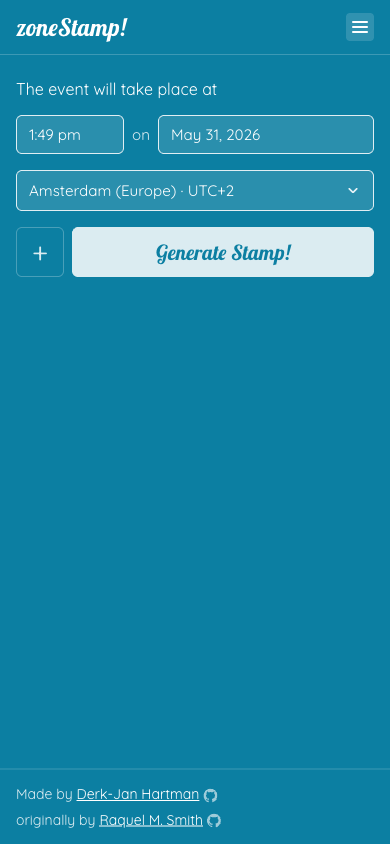
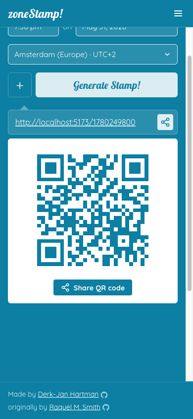
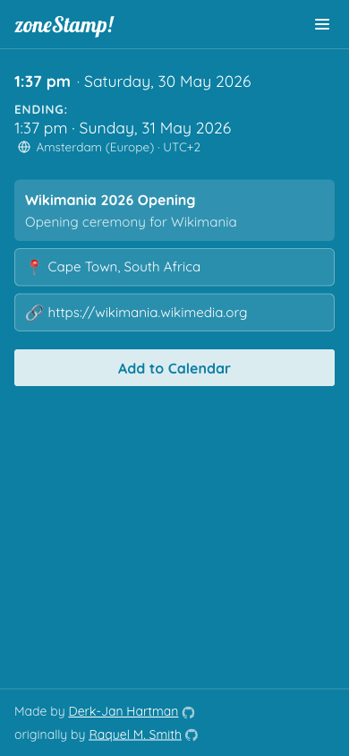

# zoneStamp!



ZoneStamp is a timezone converter for events. If you run events with an audience spread across different timezones, ZoneStamp makes it easy to create a shareable "stamp" link for your event's date and time. When a recipient clicks the link, ZoneStamp automatically shows the time in *their* timezone — no mental math required.

**Live site**: [zonestamp.toolforge.org](https://zonestamp.toolforge.org) (also at [zonestamp.com](https://zonestamp.com))

## How it works

1. Open ZoneStamp and pick the date, time, and timezone of your event.
2. Optionally add a name, description, URL, and end time.
3. Click **Generate Stamp!** to get a shareable link and QR code.
4. Paste the link in your email, newsletter, or chat — recipients see the time converted to their local timezone.

The stamp link also offers an **Add to Calendar** button for Google Calendar, Outlook, Office 365, Yahoo, and iCal downloads.

<table>
<tr>
<td></td>
<td></td>
</tr>
</table>

## URL format

Stamp URLs are portable and self-contained:

```
https://zonestamp.toolforge.org/{unix-timestamp}
https://zonestamp.toolforge.org/{start-timestamp}/{end-timestamp}?name=Event+Name&description=...
```

These URLs are stable — they will keep working as long as the site exists.
No information is stored by the website, it is all inside the stamp url and/or QR code.

## Development

This is the Vue 3 + TypeScript rewrite (branch `ng`) of the original React app. See [`docs/technical-design.md`](docs/technical-design.md) for architecture decisions and [`docs/graphical-design.md`](docs/graphical-design.md) for design system docs.

### Prerequisites

- Node.js (via nvm recommended)
- `npm install`

### Common commands

```sh
npm run dev          # dev server at http://localhost:5173
npm run build        # production build → dist/
npm run test         # Vitest unit tests (72 tests across 4 files)
npx playwright test  # E2E tests — auto-starts dev server (114 tests)
```

For a Toolforge-targeted build (uses `tools-static.wmflabs.org/fontcdn` instead of Google Fonts):

```sh
npm run build -- --mode toolforge
```

### Running tests

Unit tests live in `src/composables/__tests__/` and `src/views/__tests__/`. E2E specs are in `e2e/`. After any significant change, run both suites before considering work done.

## License

MIT — see [LICENSE](LICENSE). Originally created by [Raquel M. Smith](https://raquelmsmith.com); currently maintained by [Derk-Jan Hartman](https://github.com/hartman).
